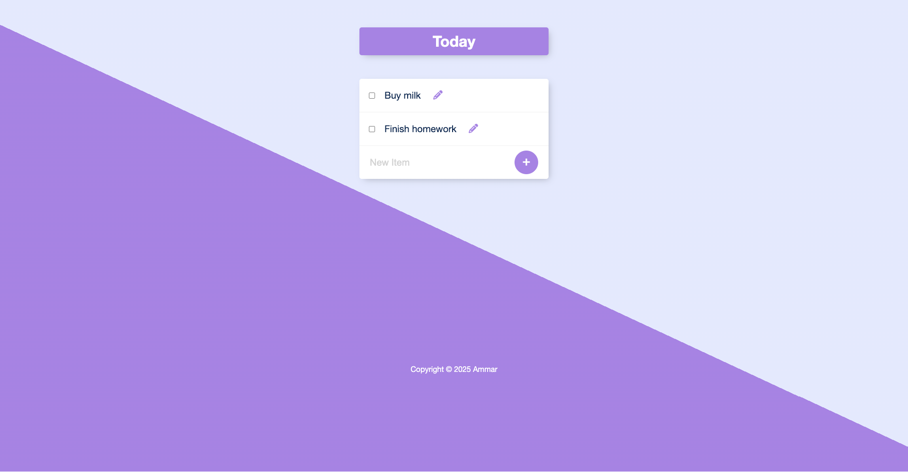

# Permalist

This project is a simple to-do list application where users can add, edit, and delete tasks. It stores data in a PostgreSQL database, allowing for persistent task management. The goal of this project was to gain experience with CRUD operations, server-side rendering, and database integration.



## Features
- Add new tasks to your to-do list.
- Edit existing tasks.
- Delete tasks when completed.
- Persistent data storage using PostgreSQL.
- Responsive design for both desktop and mobile devices.

## Technologies Used
- **Node.js**: JavaScript runtime for server-side development.
- **Express.js**: Web framework for handling HTTP requests and routing.
- **PostgreSQL**: Relational database for storing tasks.
- **EJS (Embedded JavaScript Templates)**: For dynamic server-side rendering.
- **CSS**: For basic styling and layout.

## How to Run the Project

1. **Clone the repository:**

   ```bash
   git clone https://github.com/ammarjw/permalist.git
   cd permalist
   ```

2. **Install dependencies:**

   ```bash
   npm install
   ```

3. **Create a `.env` file** in the project root:

   ```plaintext
   DB_USER=postgres
   DB_HOST=localhost
   DB_NAME=todolist
   DB_PASSWORD=your_server_password
   DB_PORT=5432
   PORT=3000
   ```

4. **Run the app:**

   Using Nodemon for auto-reload on code changes:
   ```bash
   nodemon index.js
   ```
   Or simply:
   ```bash
   node index.js
   ```

   ### Quick Tip
   If Nodemon isn't installed:
   ```bash
   npm install -g nodemon
   ```

5. **Open the app:**  
   Visit `http://localhost:3000` in your browser to see the app in action.

## Notes
- Ensure PostgreSQL is running and the database `todolist` is set up correctly.
- Create the `items` table with the following SQL:
  ```sql
  CREATE TABLE items (
    id SERIAL PRIMARY KEY,
    title VARCHAR(255) NOT NULL
  );
  ```
- The project focuses on functionality with basic styling. Feel free to enhance the UI or add new features as needed.

